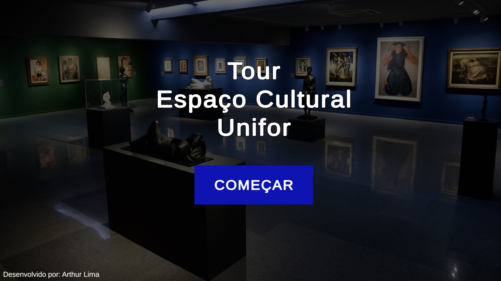
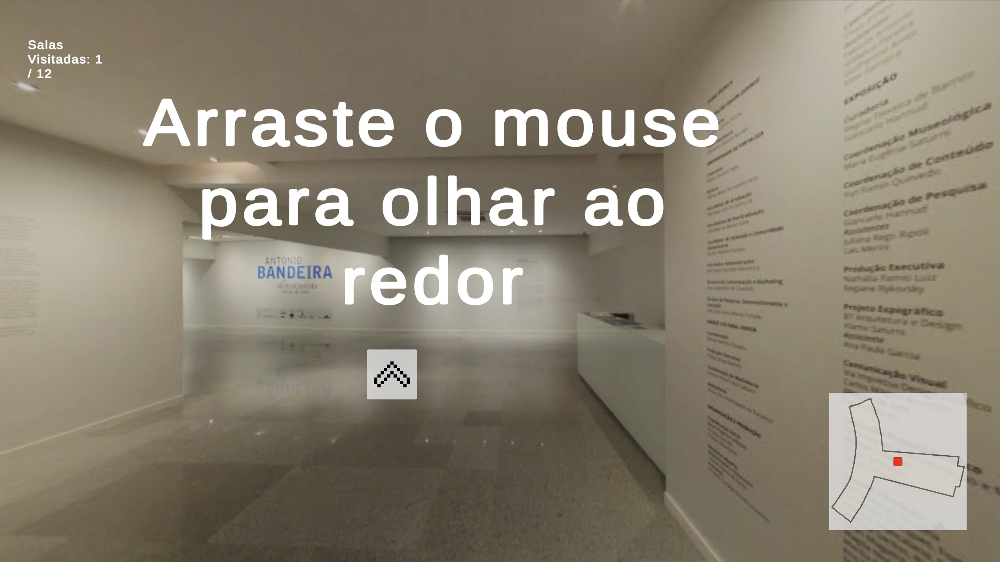
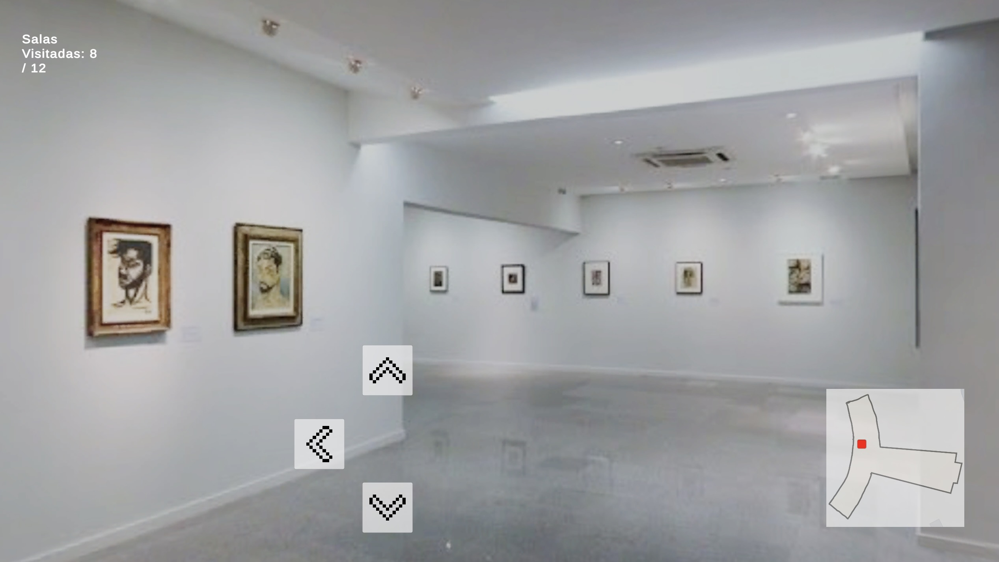
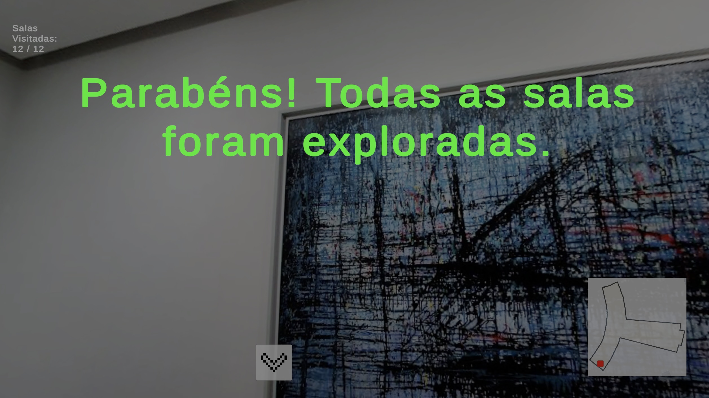

# 🏛️ Espaço Cultural Tour — Navegador 360º Interativo WebGL

> **Projeto desenvolvido para o Desafio Técnico do Processo Seletivo de Estágio em Jogos — Laboratório Vortex (Universidade de Fortaleza - UNIFOR)**.

[](https://unity.com/)
[](https://vercel.com/)
[](LICENSE)

---

## 📌 Visão Geral do Projeto

O **Espaço Cultural Tour** é uma aplicação WebGL interativa que replica o funcionamento do *Google Street View* em uma plataforma dedicada. A aplicação permite a navegação panorâmica em 360º pelas galerias de arte do **Espaço Cultural da Unifor**, conectando pontos reais e proporcionando uma simulação imersiva de caminhada pelo ambiente.

🌐 **Acesse a Aplicação Online (Deploy WebGL):** [https://espacoculturaltour.vercel.app](https://espacoculturaltour.vercel.app)  

---

## 📸 Fluxo da Aplicação & Demonstração Visual

<div align="center">

| 1. Menu Principal | 2. Tutorial de Início |
| :---: | :---: |
|  |  |
| *Tela de abertura com botão interativo para iniciar o tour.* | *Instruções iniciais para orientação do usuário no ambiente 360º.* |

<br/>

| 3. Navegação 360º & Minimapa | 4. Conclusão da Exploração |
| :---: | :---: |
|  |  |
| *Navegação pelas salas, setas de transição (hotspots) e minimapa em tempo real.* | *Mecânica de gamificação com feedback ao explorar todas as 12 salas.* |

</div>

---

## ⚡ Requisitos Técnicos Atendidos

Conforme as diretrizes do edital do Laboratório Vortex:

### ✅ Requisitos Mínimos (Obrigatórios)
* **Motor de Jogos:** Desenvolvido no Unity 6.
* **Imagens de Lugares Reais e Conectadas:** Mais de 10 imagens panorâmicas 360º do Espaço Cultural Unifor mapeadas logicamente.
* **Navegação Multimodal:**
  * Navegação entre imagens via **clique do mouse** (*Hotspots*).
  * Navegação entre imagens via **teclado**.
* **Build WebGL:** Aplicação compilada nativamente para a Web e disponibilizada publicamente para avaliação.

### ✨ Requisitos Bônus (Diferenciais Implementados)
* 🎮 **Mecânicas de Gamificação:** Contador visual de salas visitadas (`Salas Visitadas: X / 12`) e tela de parabéns ao concluir a exploração do espaço.
* 🎧 **Feedbacks Sonoros e Visuais:** Efeitos de áudio e transições visuais ao interagir com o menu e os pontos de navegação.
* 🔍 **Zoom / Pan:** Rotação e movimentação livre de câmera panorâmica.
* 🗺️ **Minimapa Interativo:** Indicador visual que reflete em tempo real a posição e localização do visitante.

---

---

## 🤖 Diário de Bordo: Uso e Curadoria de Inteligência Artificial

Este projeto contou com o apoio de Ferramentas de Inteligência Artificial Generativa atuando como **copiloto de desenvolvimento e tutor técnico**. A abordagem adotada priorizou o **uso consciente, ético e crítico da IA**, onde nenhuma solução foi integrada ao projeto sem o devido entendimento, validação e adaptação manual.

---

### 1. Filosofia de Uso da IA

* **IA como Copiloto, não Autora:** A IA foi utilizada para acelerar o aprendizado de sintaxes, tirar dúvidas pontuais sobre a API do Unity 6 e propor estruturas iniciais de scripts em C#.
* **Curadoria Humana:** Todas as sugestões geradas passaram por revisão de código, testes de execução e refatoração para garantir a melhor otimização para a *build* WebGL.

---

### 2. Registro de Interações e Soluções Desenvolvidas

| Etapa do Projeto | Atuação da IA | Intervenção Humana / Curadoria Técnica |
| :--- | :--- | :--- |
| **Arquitetura da Navegação** | Sugestão inicial da estrutura de nós para navegação entre salas em $360^\circ$. | Recusa da sugestão da IA de carregar múltiplas Cenas do Unity (o que pesaria a *build* WebGL). Opção por manter **uma única cena** e trocar dinamicamente o `RenderSettings.skybox` via código. |
| **Scripts C# (`NavigationNode` e `Manager`)** | Auxílio na lógica de navegação por Grafo (`forwardNode`, `leftNode`, etc.) e controle do progresso. | Implementação da estrutura de dados `HashSet<NavigationNode>` para garantir que salas visitadas não fossem contadas duplicadamente no contador da UI. |
| **Controle de Câmera (`CameraController`)** | Proposta de código para movimentação da câmera e zoom via rolagem do mouse. | Adaptação e atualização do código para a API moderna **New Input System** (`Mouse.current.delta.ReadValue()`), além do ajuste matemático de limitação de rotação com `Mathf.Clamp` para evitar o *gimbal lock*. |
| **Interatividade (`Hotspot`)** | Exemplos de tratamento de clique e eventos do mouse em objetos 3D. | Implementação do feedback visual via escala nos métodos `OnMouseEnter` e `OnMouseExit`, além do vínculo do evento `OnMouseDown` com as chamadas do gerenciador. |
| **Integração com a UI e Áudio** | Orientações de passo a passo no Editor para vincular botões e componentes. | Montagem manual da hierarquia na cena, configuração das variáveis públicas no Inspector, integração de áudios de passos (`footstepsSFX`) e vinculação dos eventos `OnClick()` da UI. |

---

### 3. Principais Desafios e Refatorações

1. **Atualização de APIs do Unity 6:**
   * **Desafio:** Algumas sugestões iniciais da IA utilizavam métodos legados (como `Input.GetAxis("Mouse X")`).
   * **Ação:** Refatoração manual de todas as chamadas de *input* para a biblioteca `UnityEngine.InputSystem` moderna.
2. **Otimização de Carregamento:**
   * **Desafio:** Garantir trocas de salas instantâneas e sem *stuttering* no navegador.
   * **Ação:** Validação da chamada `DynamicGI.UpdateEnvironment()` junto da troca do material com shader `Skybox/Cubemap`, garantindo atualização fluida de iluminação.

---

### 4. Conclusão sobre o Impacto da IA no Projeto

O uso da Inteligência Artificial acelerou drasticamente o ciclo de aprendizado e desenvolvimento, permitindo focar na experiência do usuário e na arquitetura do software. A postura crítica na seleção e correção do código garantiu um projeto robusto, otimizado e com total domínio do autor sobre a solução entregue.

---

## 📁 Organização do Projeto

A estrutura de diretórios do repositório segue rigorosamente a especificação do edital:

```text
EspacoCulturalTour/
├── Assets/                # Scripts C#, Materiais, Texturas 360°, Prefabs e Cenas
├── Packages/              # Pacotes e dependências do projeto Unity
├── ProjectSettings/       # Configurações do projeto e WebGL Player Settings
├── screenshots/           # Capturas de tela (Menu, Tutorial, CenaExemplo, Conclusao)
└── README.md              # Documentação oficial e Diário de Bordo da IA
